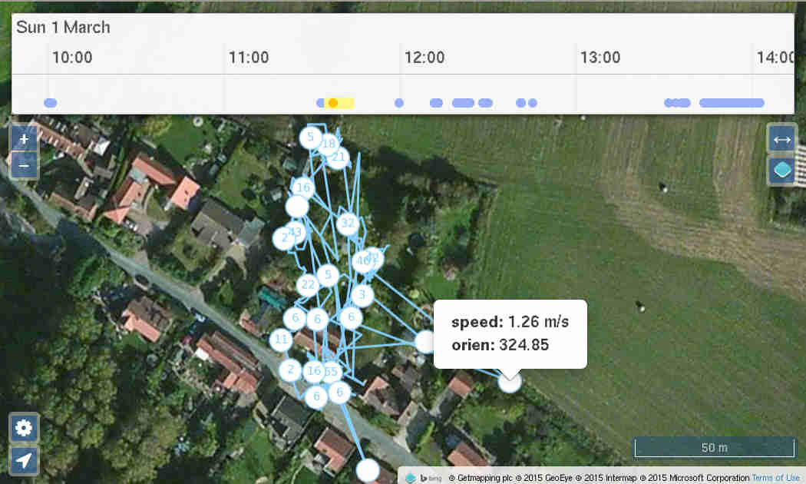

GISrec receives data over TCP in the [GPRMC format](http://aprs.gids.nl/nmea/#rmc), and then makes it available to an HTTP client.

## Features

 * supports the Xexun GPRS wire format

## Issues

 * need to get Bing Maps API key
 * when full screen, models do not show
 * historic playback
 * remove 'inactive' class, figure out how to make do with just 'active'
 * [make it an app](http://www.html5rocks.com/en/mobile/fullscreen/)
 * local storage for naming/groups, plus share back to server
 * group broadcast events (reg/unreg)
 * meta data tagging/hovers/etc
 * pruner for old unreg devices
 * auto-zoom/focus
 * data storage format
  * recording coalescer
  * HTTP cache friendly
 * handle the [GPRMC checksum](http://www.tigoe.com/pcomp/code/Processing/127/)
 * check xexun length and crc16
 * websocket reconnect
 * handle various projections, for example OSM uses EPSG:900913 whilst my GeoJSON data is in EPSG:4326

# Preflight

These instructions are for [Debian 'jessie' 8.x](https://www.debian.org/) but should be easily adaptable to other operating systems (including Mac OS X and Windows).

Now to fetch GISrec and set up its dependencies:

    sudo apt-get update
    sudo apt-get install -yy --no-install-recommends git ca-certificates nodejs nodejs-legacy npm build-essential
    
    git clone https://github.com/jimdigriz/gisrec.git
    cd gisrec
    
    git submodule update --init
    npm install

# Run

    npm start

# Install

We use [runit](http://www.mikeperham.com/2014/07/07/use-runit/) for this task:

    sudo apt-get install -yy --no-install-recommends runit
    sudo update-service --add $(pwd)/runit gisrec

# Usage

When running, you get to the main user interface by pointing your web browser at [http://localhost:27270/](http://localhost:27270/) to get to the user interface.  GPS data is collected over TCP to a socket on `27271/tcp`; see below for device configuration.

There main features of the interface are:

 * typical [OpenStreetMap](http://www.openstreetmap.org/) interactable map
 * scroll and zoomable timeline which is primarily used to group data points into sets.  So you can state that your tracker was attached to the cat 'Lulu for some data points', whilst for other points it was on 'Jones'
 * double click on the timeline to open the group name editor
 * two control widgets in the bottom right
  * location arrow opens the 'channels' window
  * the cog opens the settings page - from here you can enable some basic JavaScript console debugging
 * the 'channels' window
  * lists the channels (devices) that are available to tune into
  * 'unregistered' button to subscribe to new devices you are not colelcting historic data for
  * 'refresh' button to get any new devices; refreshing with 'unregistered' enabled will fetch a full list of unregistered devices
  * location arrow enables reception of live GPS data, as well as fetching the latest data point
  * history button will display all the histroy data recorded
  * add button registers devices, so that historic data is now recorded
  * trash button to delete the device and any historic data associated with it

# Testing

Now from a terminal run:

    echo "$(date -u +'%y%m%d%H%M%S'),+441234567891,GPRMC,$(date -u +'%H%M%S').000,A,3817.5552,N,14125.4289,E,0.00,136.36,$(date -u +'%d%m%y'),,,A*6C,F,, imei:012345678901234,08,69.4,F:4.18V,0,140,2068,123,10,10AB,40BC" \
    	| nc -q0 localhost 27271

Now go to 'location' (arrow in the bottom left) and in the pop up window click on 'Refresh'.  In that window should appear a channel with the ID '012345678901234', where you should click on the location arrow to the right of it.  Now a marker should appear just off the coast of Japan and if you scroll the timeline at the top, you should see a point marked for the current timestamp.

Recordings appear in the `data` directory of the project.  If the device is 'unregistered' you get no historic data, just a single [GeoJSON formatted file](http://geojson.org/) named after the device ID '012345678901234'.  If the device is registered, then instead you will find a directory named '012345678901234' containing an ISO timestamp named file for each point.

## Replaying PCAPs

The following is good to capture some sample traffic:

    tcpdump -n -p -w - -U '(dst host 1.2.3.4 and dst port 27271) or (src host 1.2.3.4 and src port 27271)' \
    	| tee /tmp/dump.pcap \
    	| tcpdump -n -r - -A

Later if you want to replay it, you can run the following:

    ngrep -q -W byline -I dump.pcap | grep GPRMC | nc -q0 localhost 27271

# Devices

## Xexun TK201-2 (and possibly others)

SMS the following to the phone number of the SIM in your Xexun tracker (where `192.0.2.69` is the IP address of your server and `giffgaff.com` is your APN):

    begin123456
    adminip123456 192.0.2.69 27271
    apn123456 giffgaff.com

**N.B.** `123456` is the default factory password

To configure the device to send a data point once every five seconds send it:

    t005s***n123456

To disable auto-track, send:

    notn123456

### Related Links

  * [Manufacturers Product Page](http://www.gpstrackerchina.com/p131-GPS-Portable-Tracker-TK201-2/)
  * [Manual](http://www.jimsgpstracker.com/manual/tk201-user-manual.pdf)
   * [SMS API](http://g-homeserver.com/attachments/harley-davidson/1653d1361528231-harley-g-5-alarmanlage-mit-gps-ortung-tracker-tracking-software-xt-009-user-manual.pdf)
